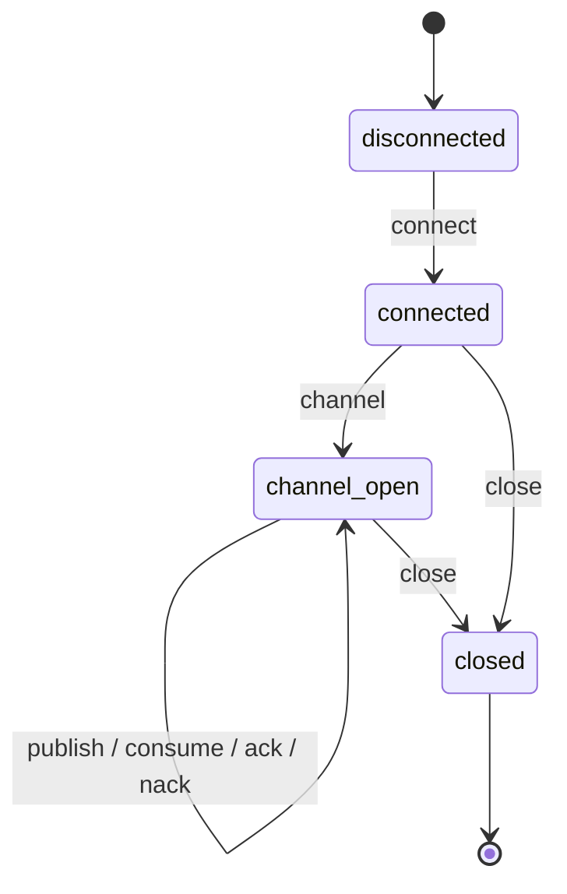

# PikaPlugin Guide

`PikaPlugin` replaces `pika.BlockingConnection` with a fake class that routes all RabbitMQ operations through a session script. It intercepts connection creation, channel opening, message publishing, consuming, acknowledgement, and connection closure.

## Installation

```bash
pip install python-tripwire[pika]
```

This installs `pika`.

## Setup

In pytest, access `PikaPlugin` through the `tripwire.pika` proxy. It auto-creates the plugin for the current test on first use:

```python
import tripwire

def test_publish_message():
    (tripwire.pika
        .new_session()
        .expect("connect",  returns=None)
        .expect("channel",  returns=None)
        .expect("publish",  returns=None)
        .expect("close",    returns=None))

    with tripwire:
        import pika
        connection = pika.BlockingConnection(
            pika.ConnectionParameters(host="rabbitmq.example.com")
        )
        channel = connection.channel()
        channel.basic_publish(exchange="", routing_key="tasks", body=b"hello")
        connection.close()

    tripwire.pika.assert_connect(host="rabbitmq.example.com", port=5672, virtual_host="/")
    tripwire.pika.assert_channel()
    tripwire.pika.assert_publish(
        exchange="", routing_key="tasks", body=b"hello", properties=None,
    )
    tripwire.pika.assert_close()
```

For manual use outside pytest, construct `PikaPlugin` explicitly:

```python
from tripwire import StrictVerifier
from tripwire.plugins.pika_plugin import PikaPlugin

verifier = StrictVerifier()
pika = PikaPlugin(verifier)
```

Each verifier may have at most one `PikaPlugin`. A second `PikaPlugin(verifier)` raises `ValueError`.

## State machine



The `connect` step fires automatically during `pika.BlockingConnection(...)` construction. After connecting, you must open a channel before publishing or consuming. The `close` step is valid from both `connected` (skipping channel) and `channel_open`.

## Session scripting

Use `new_session()` to create a `SessionHandle` and chain `.expect()` calls:

```python
(tripwire.pika
    .new_session()
    .expect("connect",  returns=None)
    .expect("channel",  returns=None)
    .expect("publish",  returns=None)
    .expect("publish",  returns=None)
    .expect("close",    returns=None))
```

### `expect()` parameters

| Parameter | Type | Default | Description |
|---|---|---|---|
| `method` | `str` | required | Step name (see below) |
| `returns` | `Any` | required | Value returned by the step |
| `raises` | `BaseException \| None` | `None` | Exception to raise instead of returning |
| `required` | `bool` | `True` | Whether an unused step causes `UnusedMocksError` at teardown |

### Steps

| Step | Description |
|---|---|
| `connect` | Connection established via `BlockingConnection(...)` |
| `channel` | Channel opened via `connection.channel()` |
| `publish` | Message published via `channel.basic_publish(...)` |
| `consume` | Consumer registered via `channel.basic_consume(...)` |
| `ack` | Message acknowledged via `channel.basic_ack(...)` |
| `nack` | Message negatively acknowledged via `channel.basic_nack(...)` |
| `close` | Connection closed via `connection.close()` |

## Asserting interactions

Each step records an interaction on the timeline. Use the typed assertion helpers on `tripwire.pika`:

### `assert_connect(*, host, port, virtual_host)`

```python
tripwire.pika.assert_connect(host="rabbitmq.example.com", port=5672, virtual_host="/")
```

### `assert_channel()`

No fields are required.

```python
tripwire.pika.assert_channel()
```

### `assert_publish(*, exchange, routing_key, body, properties)`

```python
tripwire.pika.assert_publish(
    exchange="", routing_key="tasks", body=b"process this", properties=None,
)
```

### `assert_consume(*, queue, auto_ack)`

```python
tripwire.pika.assert_consume(queue="tasks", auto_ack=False)
```

### `assert_ack(*, delivery_tag)`

```python
tripwire.pika.assert_ack(delivery_tag=1)
```

### `assert_nack(*, delivery_tag, requeue)`

```python
tripwire.pika.assert_nack(delivery_tag=1, requeue=True)
```

### `assert_close()`

No fields are required.

```python
tripwire.pika.assert_close()
```

## Full example

**Production code** (`examples/pika_queue/app.py`):

```python
--8<-- "examples/pika_queue/app.py"
```

**Test** (`examples/pika_queue/test_app.py`):

```python
--8<-- "examples/pika_queue/test_app.py"
```

## Consume and acknowledge flow

A full consumer pattern with explicit acknowledgement:

```python
import pika
import tripwire

def test_consume_and_ack():
    (tripwire.pika
        .new_session()
        .expect("connect",  returns=None)
        .expect("channel",  returns=None)
        .expect("consume",  returns="consumer-tag-1")
        .expect("ack",      returns=None)
        .expect("close",    returns=None))

    with tripwire:
        params = pika.ConnectionParameters(host="localhost")
        connection = pika.BlockingConnection(params)
        channel = connection.channel()
        channel.basic_consume(queue="work", auto_ack=False)
        channel.basic_ack(delivery_tag=1)
        connection.close()

    tripwire.pika.assert_connect(host="localhost", port=5672, virtual_host="/")
    tripwire.pika.assert_channel()
    tripwire.pika.assert_consume(queue="work", auto_ack=False)
    tripwire.pika.assert_ack(delivery_tag=1)
    tripwire.pika.assert_close()
```

## Negative acknowledgement

Use `nack` to reject and optionally requeue a message:

```python
def test_nack_and_requeue():
    (tripwire.pika
        .new_session()
        .expect("connect",  returns=None)
        .expect("channel",  returns=None)
        .expect("consume",  returns="consumer-tag-1")
        .expect("nack",     returns=None)
        .expect("close",    returns=None))

    with tripwire:
        params = pika.ConnectionParameters(host="localhost")
        connection = pika.BlockingConnection(params)
        channel = connection.channel()
        channel.basic_consume(queue="work", auto_ack=False)
        channel.basic_nack(delivery_tag=1, requeue=True)
        connection.close()

    tripwire.pika.assert_connect(host="localhost", port=5672, virtual_host="/")
    tripwire.pika.assert_channel()
    tripwire.pika.assert_consume(queue="work", auto_ack=False)
    tripwire.pika.assert_nack(delivery_tag=1, requeue=True)
    tripwire.pika.assert_close()
```
