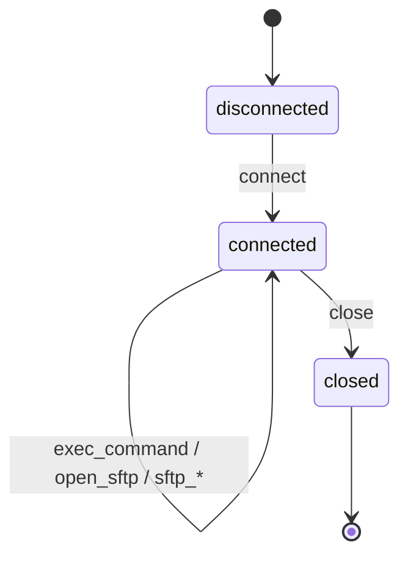

# SshPlugin Guide

`SshPlugin` replaces `paramiko.SSHClient` with a fake class that routes all SSH operations through a session script. It intercepts connection, command execution, SFTP file transfers, and connection closure.

## Installation

```bash
pip install python-tripwire[paramiko]
```

This installs `paramiko`.

## Setup

In pytest, access `SshPlugin` through the `tripwire.ssh` proxy. It auto-creates the plugin for the current test on first use:

```python
import tripwire

def test_remote_command():
    (tripwire.ssh
        .new_session()
        .expect("connect",      returns=None)
        .expect("exec_command", returns=(None, b"hello\n", b""))
        .expect("close",        returns=None))

    with tripwire:
        import paramiko
        client = paramiko.SSHClient()
        client.set_missing_host_key_policy(paramiko.AutoAddPolicy())
        client.connect("server.example.com", username="deploy")
        stdin, stdout, stderr = client.exec_command("echo hello")
        client.close()

    tripwire.ssh.assert_connect(
        hostname="server.example.com", port=22, username="deploy", auth_method="password",
    )
    tripwire.ssh.assert_exec_command(command="echo hello")
    tripwire.ssh.assert_close()
```

For manual use outside pytest, construct `SshPlugin` explicitly:

```python
from tripwire import StrictVerifier
from tripwire.plugins.ssh_plugin import SshPlugin

verifier = StrictVerifier()
ssh = SshPlugin(verifier)
```

Each verifier may have at most one `SshPlugin`. A second `SshPlugin(verifier)` raises `ValueError`.

## State machine



Unlike pika.BlockingConnection, `paramiko.SSHClient()` does not connect on construction. The `connect()` call is explicit. Once connected, command execution, SFTP operations, and additional SFTP file operations are all self-transitions on the `connected` state.

## Session scripting

Use `new_session()` to create a `SessionHandle` and chain `.expect()` calls:

```python
(tripwire.ssh
    .new_session()
    .expect("connect",      returns=None)
    .expect("exec_command", returns=(None, b"output", b""))
    .expect("exec_command", returns=(None, b"done", b""))
    .expect("close",        returns=None))
```

### `expect()` parameters

| Parameter | Type | Default | Description |
|---|---|---|---|
| `method` | `str` | required | Step name (see below) |
| `returns` | `Any` | required | Value returned by the step |
| `raises` | `BaseException \| None` | `None` | Exception to raise instead of returning |
| `required` | `bool` | `True` | Whether an unused step causes `UnusedMocksError` at teardown |

### Steps

| Step | Description |
|---|---|
| `connect` | Connection established via `client.connect(...)` |
| `exec_command` | Remote command executed via `client.exec_command(...)` |
| `open_sftp` | SFTP session opened via `client.open_sftp()` |
| `sftp_get` | File downloaded via `sftp.get(remotepath, localpath)` |
| `sftp_put` | File uploaded via `sftp.put(localpath, remotepath)` |
| `sftp_listdir` | Directory listed via `sftp.listdir(path)` |
| `sftp_stat` | File stat retrieved via `sftp.stat(path)` |
| `sftp_mkdir` | Directory created via `sftp.mkdir(path)` |
| `sftp_remove` | File removed via `sftp.remove(path)` |
| `close` | Connection closed via `client.close()` |

## Asserting interactions

Each step records an interaction on the timeline. Use the typed assertion helpers on `tripwire.ssh`:

### `assert_connect(*, hostname, port, username, auth_method)`

The `auth_method` is automatically determined: `"key"` if `pkey` or `key_filename` is passed to `connect()`, otherwise `"password"`.

```python
tripwire.ssh.assert_connect(
    hostname="server.example.com", port=22, username="deploy", auth_method="password",
)
```

### `assert_exec_command(*, command)`

```python
tripwire.ssh.assert_exec_command(command="systemctl restart nginx")
```

### `assert_open_sftp()`

No fields are required.

```python
tripwire.ssh.assert_open_sftp()
```

### `assert_sftp_get(*, remotepath, localpath)`

```python
tripwire.ssh.assert_sftp_get(remotepath="/var/log/app.log", localpath="/tmp/app.log")
```

### `assert_sftp_put(*, localpath, remotepath)`

```python
tripwire.ssh.assert_sftp_put(localpath="/tmp/config.yaml", remotepath="/etc/app/config.yaml")
```

### `assert_sftp_listdir(*, path)`

```python
tripwire.ssh.assert_sftp_listdir(path="/var/log")
```

### `assert_sftp_stat(*, path)`

```python
tripwire.ssh.assert_sftp_stat(path="/etc/app/config.yaml")
```

### `assert_sftp_mkdir(*, path)`

```python
tripwire.ssh.assert_sftp_mkdir(path="/var/data/exports")
```

### `assert_sftp_remove(*, path)`

```python
tripwire.ssh.assert_sftp_remove(path="/tmp/old-backup.tar.gz")
```

### `assert_close()`

No fields are required.

```python
tripwire.ssh.assert_close()
```

## Full example

**Production code** (`examples/ssh_remote/app.py`):

```python
--8<-- "examples/ssh_remote/app.py"
```

**Test** (`examples/ssh_remote/test_app.py`):

```python
--8<-- "examples/ssh_remote/test_app.py"
```

## Key-based authentication

When `pkey` or `key_filename` is passed to `connect()`, the `auth_method` detail is set to `"key"`:

```python
def test_key_auth():
    (tripwire.ssh
        .new_session()
        .expect("connect",      returns=None)
        .expect("exec_command", returns=(None, b"ok", b""))
        .expect("close",        returns=None))

    with tripwire:
        client = paramiko.SSHClient()
        client.set_missing_host_key_policy(paramiko.AutoAddPolicy())
        client.connect("bastion.example.com", username="ops", key_filename="/home/ops/.ssh/id_ed25519")
        client.exec_command("whoami")
        client.close()

    tripwire.ssh.assert_connect(
        hostname="bastion.example.com", port=22, username="ops", auth_method="key",
    )
    tripwire.ssh.assert_exec_command(command="whoami")
    tripwire.ssh.assert_close()
```

## SFTP file operations

A full SFTP session with multiple file operations:

```python
def test_sftp_operations():
    (tripwire.ssh
        .new_session()
        .expect("connect",       returns=None)
        .expect("open_sftp",     returns=None)
        .expect("sftp_listdir",  returns=["data.csv", "report.pdf"])
        .expect("sftp_get",      returns=None)
        .expect("sftp_mkdir",    returns=None)
        .expect("sftp_put",      returns=None)
        .expect("sftp_remove",   returns=None)
        .expect("close",         returns=None))

    with tripwire:
        client = paramiko.SSHClient()
        client.set_missing_host_key_policy(paramiko.AutoAddPolicy())
        client.connect("fileserver.example.com", username="sync")
        sftp = client.open_sftp()
        files = sftp.listdir("/data/incoming")
        sftp.get("/data/incoming/data.csv", "/tmp/data.csv")
        sftp.mkdir("/data/processed")
        sftp.put("/tmp/result.csv", "/data/processed/result.csv")
        sftp.remove("/data/incoming/data.csv")
        client.close()

    tripwire.ssh.assert_connect(
        hostname="fileserver.example.com", port=22, username="sync", auth_method="password",
    )
    tripwire.ssh.assert_open_sftp()
    tripwire.ssh.assert_sftp_listdir(path="/data/incoming")
    tripwire.ssh.assert_sftp_get(remotepath="/data/incoming/data.csv", localpath="/tmp/data.csv")
    tripwire.ssh.assert_sftp_mkdir(path="/data/processed")
    tripwire.ssh.assert_sftp_put(localpath="/tmp/result.csv", remotepath="/data/processed/result.csv")
    tripwire.ssh.assert_sftp_remove(path="/data/incoming/data.csv")
    tripwire.ssh.assert_close()
```
